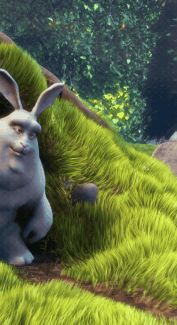
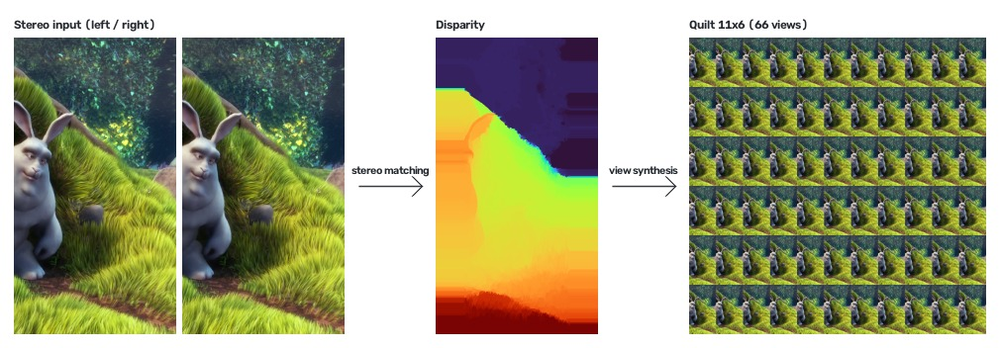
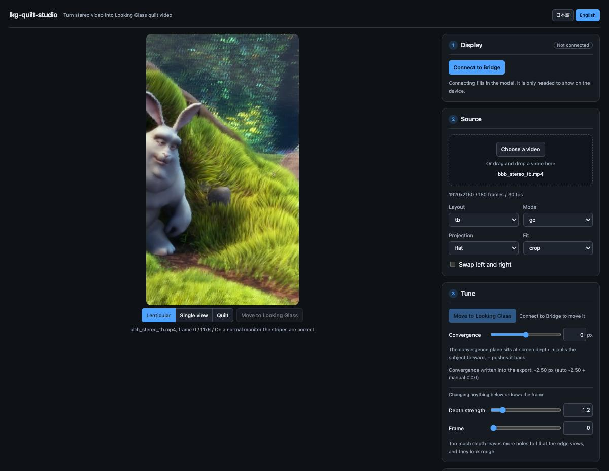

# lkg-quilt-studio

[English](README.md) | 日本語

ステレオ動画（左右 2 視点）を [Looking Glass](https://lookingglassfactory.com/) 用の
quilt 動画に変換して、ブラウザで再生するツール。

この文書は [README.md](README.md) の日本語訳。食い違うときは英語版が正。

<p align="center">
  
</p>

<p align="center">
  <sub>変換した 1 フレーム。quilt の 66 視点から 11 視点を抜いて切り替えている。<br>
  実機では、見る角度でこれが切り替わる。</sub>
</p>

## 仕組み

Looking Glass は数十の視点を同時に表示し、見る角度ごとに別の視点を届ける。
ステレオ動画には 2 視点しかない。converter はその 2 枚の視差から奥行きを求め、
間と外側の視点を合成して quilt に並べる。

```text
ステレオ動画 → 視差 → 視点合成 → quilt 動画 → ブラウザで再生
└──── converter（Python・事前変換）────┘  └─ viewer（Vue 3 + three.js）─┘
```



左右の入力、そこから求めた視差、できた quilt。Looking Glass Go なら 11 × 6 タイルで、
4092 × 4092 の 1 枚に 66 視点が入る。

`converter/` は Python の CLI で、HTTP API も持つ。`viewer/` は動画を上げて、
調整して、進捗を見て、再生する Web アプリ。奥行き推定と視点合成は再生中に
回せるほど速くないので、変換は先に済ませる。

## 必要なもの

- Docker Desktop。ほかは入れなくてよい
- 実機に出すなら、Looking Glass 本体と Looking Glass Bridge（ホスト側）

Docker を使わない場合は [mise](https://mise.jdx.dev/)（node と uv を入れる。
バージョンは `.mise.toml`）と ffmpeg。

## セットアップ

Docker:

```bash
docker compose build
```

ローカル:

```bash
mise install
uv python install 3.14
(cd converter && uv sync)
(cd viewer && npm ci)
```

## 使い方

以下は Docker のコマンド。ローカルでは次のように読み替える。

| | Docker | ローカル |
| --- | --- | --- |
| アプリ | `docker compose up` | `cd viewer && npm run dev` と `cd converter && uv run lkg-quilt-api` |
| CLI | `docker compose run --rm converter …` | `cd converter && uv run lkg-quilt-converter …` |

入力動画はリポジトリの中（`samples/` など）に置く。コンテナにはリポジトリ全体が
マウントされるので、リポジトリからの相対パスがそのまま使える。

### サンプルを用意する

手元にステレオ動画が無ければ、上下並びステレオ版の
[Big Buck Bunny](https://peach.blender.org/) から 6 秒を切り出せる。

```bash
./scripts/fetch-sample.sh   # samples/bbb_stereo_tb.mp4 ができる。57 MB 取得
```

1920 × 2160 で、1920 × 1080 の 2 枚が上下に並び、上が左眼。ステレオマッチングには
模様が要る。芝や毛はよく効き、平らな壁は効かない。

### ブラウザで変換する

```bash
docker compose up   # http://localhost:5173
```



左が絵、右のパネルが作業の順番。右上のボタンで日本語と英語を切り替える。

1. **ディスプレイ。** Bridge に接続すると機種が入る。接続は必須ではない。
   既定は `go` で、機種が合っていればプレビューも書き出しも Bridge なしで通る
2. **素材。** 動画を選ぶかドロップする。上げるのは 1 回だけ。並びと写り方は中身から
   判定して、1 枚目が左に出る
3. **調整。** 絵を Looking Glass へ移し、実機を見ながら動かす。収束面と視点はすぐ効く。
   立体の強さ・視野角・フレームは絵を作り直すので、スライダーを離すと自動で描き直す
4. **書き出し。** 一部だけ焼くなら開始とフレーム数を入れて、書き出す。終わると
   再生とダウンロードができる

プレビューと書き出しは同じ経路で描くので、調整した絵がそのまま焼ける。決めた収束面も
書き出しに入る。1 フレームはノート PC で 1 秒ほど、動画はその枚数分かかるので、
先に 1 枚で詰める。

書き出しは 1 件ずつ走り、途中で止められる。ライブラリには上げた素材と書き出した
quilt が並ぶ。どちらも数百 MB になるので、ここから消せる。

### コマンドラインで変換する

```bash
docker compose run --rm converter frame   samples/movie.mp4 --output-dir out   # 1 枚だけ。調整用
docker compose run --rm converter convert samples/movie.mp4 --output-dir out
docker compose run --rm converter convert samples/vr180.mp4 --projection fisheye --fov 50
```

出力名は `<入力名>_qs<列>x<行>a<縦横比>.mp4`。viewer はこの名前からレイアウトを読むので
変えない。

| 引数 | 意味 |
| --- | --- |
| `--display go\|portrait\|16\|32` | 機種のプリセット。既定は `16`。ブラウザの既定は `go` |
| `--layout sbs\|sbs-half\|tb\|tb-half\|separate` | 入力の並び。既定は `sbs` |
| `--fit crop\|pad` | 横長の素材を縦のタイルに収める方法。既定は `crop` |
| `--span` | 立体の強さ。`1.0` が 2 台のカメラの幅で、それ以上は外挿 |
| `--convergence` | 画面の奥行きに置く視差。`auto` は最初のフレームの中央値 |
| `--swap-eyes` | 実機で奥行きが裏返って見えるときに付ける |
| `--work-dir` | 視差を保存して、やり直しで推定を飛ばす |

ほかは `--help` で見る。`--span` の既定 2.0 はサンプルには強すぎて、ウサギの耳のような
細い形が崩れる。1.0 から 1.2 がよかった。

左右が逆でも絵からは分からない。入れ替えた対は奥行きが反転した場面の正しい対になる。
実機で確かめる。

### 機種を確かめる

機種が違う quilt は正しく表示されない。Bridge を起動してアプリの **Bridge に接続**を押し、
出た機種に `--display` を合わせる。

| プリセット / 機種 | quilt | タイルの縦横比 |
| --- | --- | --- |
| `go` / Looking Glass Go | 11 × 6、4092² | 0.5625（縦） |
| `portrait` / Looking Glass Portrait | 8 × 6、3360² | 0.75（縦） |
| `16` / Looking Glass 16" | 5 × 9、4096² | 1.777（横） |
| `32` / Looking Glass 32" | 5 × 9、8192² | 1.777（横） |

Go と Portrait はタイルが縦長。横長の素材は、`--fit crop` だと真ん中の 3 分の 1 を
画面いっぱいに使い、`--fit pad` だと上下に余白を足して全部残す。crop が既定なのは、
絵を拡大すると視差も拡大されて立体感が強くなるため。

### 魚眼の素材（VR180）

VR180 は眼ごとに円形の魚眼画像を持つ。**写り方**を `fisheye` にする（CLI は
`--projection fisheye`）。converter は円を眼ごとに見つけ、中央を平面に直してから
マッチングする。これで黒い縁が消える。**視野角**（`--fov`）は 180° のうちどこまで残すか。
狭いほど鮮明で、広いほど写る範囲が増えて端が伸びる。

1080p の VR180 は 1 度あたり 5.3 ピクセルしかないので、どう変換してもぼやける。

### ブラウザで再生する

- 書き出したものは、書き出しかライブラリのパネルから再生する。動画はミュートで始まる。
  再生・シーク・音量は絵の下で操作する
- 手元の quilt mp4 や URL はライブラリのパネルから開く。開発サーバーは `out/` を
  `http://localhost:5173/out/<名前>.mp4` で配る
- 絵の下のボタンで **レンチキュラー**（実機と同じ表示。ふつうのモニタでは縞に見える）、
  **1 視点**、**quilt** 全体を切り替える

### うまくいかないとき

- **絵が真っ二つに切れている。** 並びが違う。判定は外れることがあるので、素材で選び直す
- **奥行きが平ら。** 模様の無い面は視差が決まらない。変換ログの測光残差が 10 を超えていたら
  マッチングが外れている
- **黒い縁が入る、ぼやける。** 魚眼の素材を平面として読んでいる。写り方を `fisheye` にする
- **書き出し中に ffmpeg が落ちる。** Docker のメモリ不足が疑わしい。変換は 2 GB ほど使う。
  毎回同じフレームで落ちるのが目印
- **書き出しが終わらない。** フレーム数を空にすると最後まで焼く。60 fps の 1 分は 3,600
  フレーム。先に短く切って試す
- **API が遅い、返らない。** `localhost:5173` を使った別プロジェクトの Service Worker が
  通信を横取りしていることがある。アプリは起動時に外すので、一度リロードする

## 実機で確認する

1. Looking Glass Bridge を起動して、アプリを開く
2. ディスプレイの **Bridge に接続**を押す。quilt が機種と合わないと警告が出るので、
   出たらその機種で書き出し直す
3. 調整の **Looking Glass へ移す**を押す。開いた窓を Looking Glass 側へ動かし、
   窓の中をダブルクリックして全画面にする
4. 手前のものが奥に、奥のものが手前に見えたら、素材の**左右を入れ替える**を入れる
5. **収束面**で、場面を画面の手前か奥に置く。描き直しは要らない
6. 立体感が弱ければ**立体の強さ**を上げる。上げるほど端の視点で穴埋めの粗が出るので、
   実機で見て決める

## 開発

Docker のイメージに lint とテストの道具は入っていない。チェックはローカルで、
リポジトリのルートから走らせる。

```bash
scripts/check.sh                     # 以下すべて
(cd converter && uv run poe check)   # ruff format --check、ruff check、mypy、pytest
(cd viewer && npm run check)         # prettier、vue-tsc、eslint、vite build、vitest
scripts/check-harness.sh             # scripts/ の lint と型、エージェント設定の同期
```

整形は `uv run poe format` と `npm run format` で直す。

README の図は変換の出力。パイプラインを変えたら、サンプルを用意して作り直す。

```bash
converter/.venv/bin/python scripts/make-readme-media.py   # docs/media/*
```

スクリーンショットは手で撮る。

Docker で編集するときは、`viewer/` を保存すると HMR が効く。Windows で `/mnt/c` の下に
置くと変更が届かないことがあるので、`VITE_USE_POLLING=1 docker compose up` で起動する。
`viewer/package.json` を変えたら `docker compose down -v` のあと `docker compose up --build`。
`node_modules` は名前付きボリュームにあるため。

コメントを英語に直しただけのコミットが 1 つある。
`git config blame.ignoreRevsFile .git-blame-ignore-revs` で `git blame` から外せる。

エージェント向けの指示、設計判断、検証フローは [CLAUDE.md](CLAUDE.md) にある。
Codex は [AGENTS.md](AGENTS.md) 経由で読む。

## ライセンス

[MIT](LICENSE)。

Big Buck Bunny は (c) 2008 Blender Foundation、[peach.blender.org](https://peach.blender.org/)、
[CC BY 3.0](https://creativecommons.org/licenses/by/3.0/)。動画そのものはリポジトリに
含めないが、`docs/media/` の図はこれから作ったもので、同じライセンスが掛かる。

Looking Glass は Looking Glass Factory, Inc. の商標。本プロジェクトは非公式で、
同社とは無関係。承認も受けていない。
